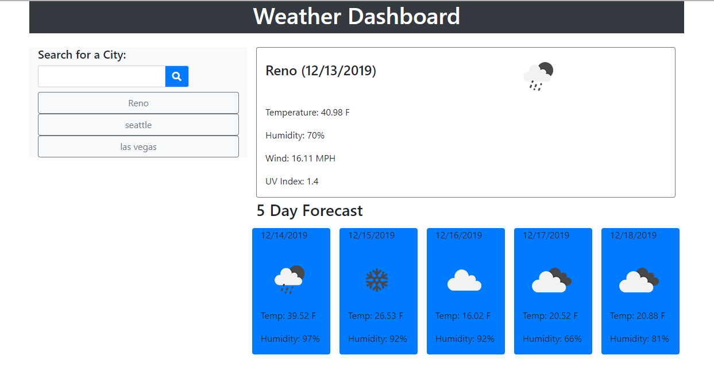

# Weather Dashboard (Homework6)

This application is a weather dashboard that provides current and forecasted weather information for a city selected by the user.  

The app has the following functionality:
 1. When the app is opened it pulls in the weather for the last searched city.
 2. Keeps a history of previously selected cities.
 3. Selecting one of previously searched cities will load the weather data for that city.

The application is located here: [Weather Dashboard](https://rcavalero.github.io/homework6/) 

The application consists of one page:
 

## Built With

* This application was built using HTML, JavaScript, jQuery, Bootstrap CSS Framework & some additional CSS styling. 
* Weather data provided by [Open Weather](https://openweathermap.org/)

## Authors

* **Robert Cavalero** - *Initial work* - [RCavalero](https://github.com/rcavalero)
